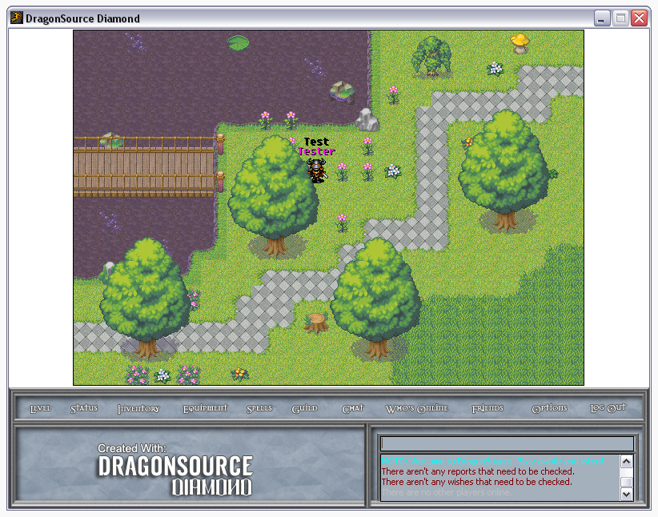



## DragonSource Diamond

### Description

A massive extension of DragonSource 1.20. This release has several new features including pets, NPC speech, extended map editor, graphical equipment, guides system, friend list, the list goes on and on.

Extract with WinRAR: 

http://www.rarlab.com

Visit our website: 

http://www.source.draignet.com

 
### More Info
 

             |
---                |---
**Submitted On**   |2012-02-15 18:49:14
**By**             |[DraigNET](https://github.com/Planet-Source-Code/PSCIndex/blob/master/ByAuthor/draignet.md)
**Level**          |Intermediate
**User Rating**    |5.0 (10 globes from 2 users)
**Compatibility**  |VB 6\.0
**Category**       |[Games](https://github.com/Planet-Source-Code/PSCIndex/blob/master/ByCategory/games__1-38.md)
**World**          |[Visual Basic](https://github.com/Planet-Source-Code/PSCIndex/blob/master/ByWorld/visual-basic.md)
**Archive File**   |[DragonSour2220152172012\.zip](https://github.com/Planet-Source-Code/draignet-dragonsource-diamond__1-74269/archive/master.zip)

